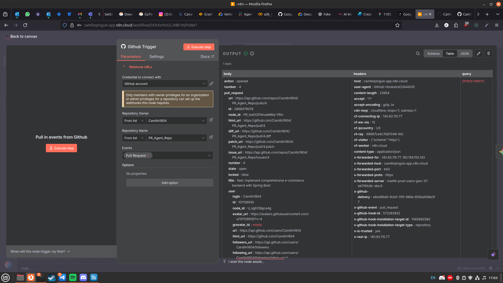
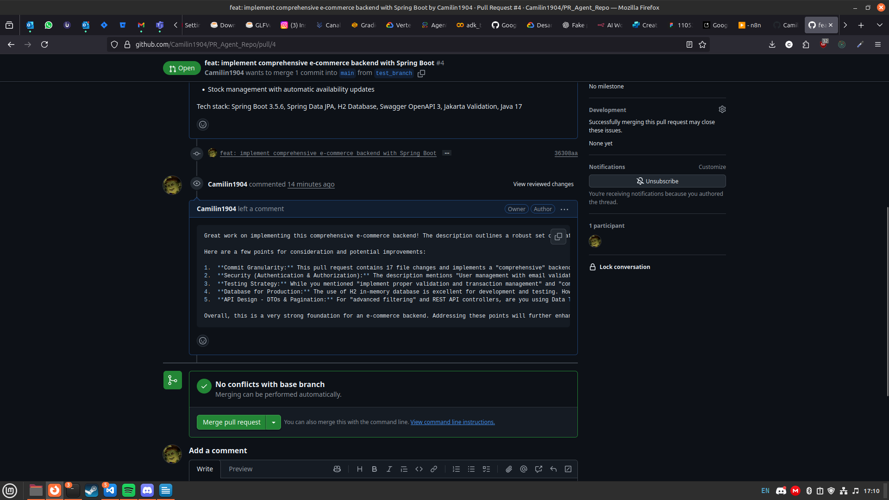

# Agente revisor de pull requests

## Estructura

Este agente es un agente sencillo de n8n que es activado cuando se realiza un pr sobre el repositorio https://github.com/Camilin1904/PR_Agent_Repo.git.

El workflow que cree se encuenta en esta misma carpeta con el nombre **Github_AutoCommentPR.json**

### Nodo Trigger:

El nodo que se encarga de activar el workflow evisa los prs ocurridos en el repositorio:

### Nodo gemini

Este nodo revisa el contenido del pr que activo el nodo anterior y realiza una review de este, revisa su estructura, buenas practicas y documentación, el promt que se le dio a gemini es este:

´´´
    Role: You are an expert software engineer specialized in reviewing Spring Boot applications. You are reviewing a GitHub pull request.

    Context:

    Repository type: Spring Boot (Java, Maven/Gradle).

    Code conventions: Follow Spring Boot best practices, clean code principles, SOLID, and security guidelines.

    Input: You have full access to the pull request, including modified files, commit messages, and diff.

    Task:
    Carefully analyze the changes introduced in this pull request. Write a meaningful review comment that is:

    Concise but insightful – avoid generic "good job" comments.

    Actionable – suggest improvements if something can be done better.

    Context-aware – refer to specific lines, methods, or classes when possible.

    Balanced – highlight positives (good practices, clean refactors, tests added) as well as potential issues (bugs, anti-patterns, missing tests, performance or security concerns).

    Respectful & professional – tone should be constructive, not harsh.

´´´

### Nodo de comentario

Finalmente con la reseña proporcionada por gemini, se realia un comentario a la pr que activo el primer nodo:

## Ejemplo de funcionamiento

en la rama de ejemplo cree un proyecto mas completo de springboot:

Este codigo lo monté a la rama test_banch:

y le di el siguiente mensaje al commit:

´´´
    feat: implement comprehensive e-commerce backend with Spring Boot
    - Add complete entity layer with User, Product, Order, and OrderItem entities
    - Implement JPA repositories with custom queries for advanced data operations
    - Create service layer with comprehensive business logic and error handling
    - Build REST API controllers with full CRUD operations and advanced filtering
    - Integrate Swagger/OpenAPI for complete API documentation
    - Configure H2 in-memory database with JPA settings
    - Add sample data initializer with realistic test data
    - Implement proper validation and transaction management
    - Add comprehensive error handling and HTTP status codes

    Features:
    - User management with email validation and soft delete
    - Product catalog with categories, stock management, and search
    - Order processing with item management and status tracking
    - Revenue calculations and reporting endpoints
    - Stock management with automatic availability updates

    Tech stack: Spring Boot 3.5.6, Spring Data JPA, H2 Database,
    Swagger OpenAPI 3, Jakarta Validation, Java 17
´´´
Luego de esta rama cree una pr a main:

Lo cual causó que mi workflow se active: 

Y finalmente obtuviera un comentario en mi pr:

El comentario generado por gemini fue el siguiente:

´´´
        Great work on implementing this comprehensive e-commerce backend! The description outlines a robust set of features and a well-structured architectural approach, covering essential components from entities to REST controllers, along with vital aspects like validation, transaction management, error handling, and API documentation. It's good to see the use of a modern stack with Spring Boot 3.5.6 and Java 17.

        Here are a few points for consideration and potential improvements:

        1.  **Commit Granularity:** This pull request contains 17 file changes and implements a "comprehensive" backend in a single commit (`36308aa`). For such a large feature, it would significantly improve reviewability and project history if these changes were broken down into smaller, logical commits (e.g., one for entities, one for repositories, one per major service/controller feature, etc.). This makes it easier to understand the evolution of the codebase and pinpoint specific changes.
        2.  **Security (Authentication & Authorization):** The description mentions "User management with email validation and soft delete," which is a good start. However, a comprehensive e-commerce backend typically requires robust authentication (e.g., JWT, OAuth2 with Spring Security) and authorization mechanisms to protect API endpoints and ensure users only access resources they are permitted to. Could you elaborate on how these critical security aspects will be handled or if they are planned for a subsequent PR?
        3.  **Testing Strategy:** While you mentioned "implement proper validation and transaction management" and "comprehensive error handling," there's no explicit mention of unit, integration, or end-to-end tests. For a critical application like an e-commerce platform, a strong testing suite is essential for reliability and maintainability. It would be beneficial to include tests for your service layer business logic and controller endpoints.
        4.  **Database for Production:** The use of H2 in-memory database is excellent for development and testing. However, for a production environment, a persistent relational database like PostgreSQL or MySQL would be necessary. This is a common practice, but worth noting to ensure future considerations are clear.
        5.  **API Design - DTOs & Pagination:** For "advanced filtering" and REST API controllers, are you using Data Transfer Objects (DTOs) to decouple your internal entity models from your API's request/response structures? This is a good practice for API versioning and preventing over-exposure of internal data. Also, for listing endpoints (e.g., product catalog, orders), consider explicit pagination and sorting parameters in the API design to handle large datasets efficiently.

        Overall, this is a very strong foundation for an e-commerce backend. Addressing these points will further enhance its quality, maintainability, and production readiness. Keep up the excellent work!
´´´